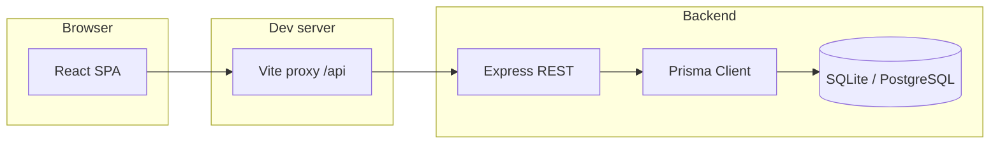

# Mini CRM · Multi-user project dashboard

Full-stack app for managing **projects** and **tasks**: JWT auth, admin/user roles, task assignment, status tracking, search, filters, and pagination — aligned with the “Multi-User Project Management Dashboard” assessment brief.

## Stack

| Layer    | Choice |
|---------|--------|
| API     | Node.js · Express 5 · TypeScript |
| Auth    | JWT (Bearer token) · bcrypt password hashing |
| ORM / DB | Prisma · **SQLite by default** (file `backend/dev.db`) |
| Frontend | React 19 · Vite · TypeScript · TanStack Query · React Router |
| Validation | Zod (API request bodies / query parsing) |

## Architecture



- **JWT** stored in `localStorage`; attached as `Authorization: Bearer <token>`.
- **Visibility**: admins see all projects; users see projects they **own** or where they have an **assigned** task (so collaborators see relevant work).
- **Permissions**: Project **owner** or **admin** manages project metadata, creates/deletes tasks, and assigns users. Assignees may **PATCH status only** unless they’re also admins/owners managing that project.

REST surface (prefixed `/api`):

- `POST /auth/register`, `POST /auth/login`, `GET /auth/me`, `GET /auth/users`
- `GET|POST /projects`, `GET|PATCH|DELETE /projects/:id` (pagination + `q`)
- `GET|POST /tasks`, `GET|PATCH|DELETE /tasks/:id` (pagination + `q`, `projectId`, `status`, `assigneeId`)

## Prerequisites

- Node.js **20+** recommended
- npm

Optional: Docker (for PostgreSQL locally). If you skip Docker, the default SQLite URL works out of the box.

## Quick start

### 1. Backend

```bash
cd backend
cp .env.example .env   # Windows: copy .env.example .env
npm install
npx prisma generate
npx prisma db push     # applies schema / creates SQLite file
npm run db:seed        # demo users below
npm run dev
```

API listens on **http://localhost:4000** (override with `PORT`).

### 2. Frontend

In a **second terminal**:

```bash
cd frontend
npm install
npm run dev
```

App: **http://localhost:5173** — dev server proxies `/api` → `localhost:4000`.

### Seed accounts

| Role  | Email            | Password  |
|-------|------------------|-----------|
| Admin | admin@demo.com   | admin123  |
| User  | user@demo.com    | user123   |

## Production hints

1. Build API: `cd backend && npm run build && npm start` (runs `dist/index.js`).
2. Build UI: `cd frontend && npm run build` → serve `frontend/dist` with any static host; point API calls to same origin or set a reverse proxy to `/api`.
3. **PostgreSQL**: set `DATABASE_URL` to a Postgres URL (see commented line in `.env.example`), change `provider` in `backend/prisma/schema.prisma` to `postgresql`, and add `mode: insensitive` where needed if you rely on Prisma case-insensitive search helpers. **`docker-compose.yml`** in the repo root runs Postgres **16** for local parity.
4. Set a strong **`JWT_SECRET`** and optional **`FRONTEND_ORIGIN`** for CORS.

## CI

GitHub Actions workflow **`.github/workflows/ci.yml`** type-checks the API and builds the SPA on push/PR.

## Repository layout

```
multi-user/
├── backend/          # Express API · Prisma schema & seed
├── frontend/       # React app
├── docker-compose.yml # optional Postgres
└── README.md
```

## Assessment mapping

| Requirement | Where it lives |
|-------------|----------------|
| Auth (signup/login JWT) | `backend/src/routes/auth.ts`, frontend `Login`/`Register`/token |
| Dashboard listing | `Dashboard.tsx`, paginated `/projects` + `/tasks` |
| Task CRUD | API `tasks.ts`; UI create, edit modal, status, delete |
| Assign + status | `assigneeId`, `TaskStatus`; row select + modal |
| Search & filter | `q`, `projectId`, `status`, `assigneeId` query params |
| Pagination | `page`, `limit` on list endpoints + UI controls |
| DB: Users / Projects / Tasks | `backend/prisma/schema.prisma` with indexes/FKs |
| Bonus: Admin vs User | `Role` enum, `visibleProjectWhere`, admin shortcuts |
